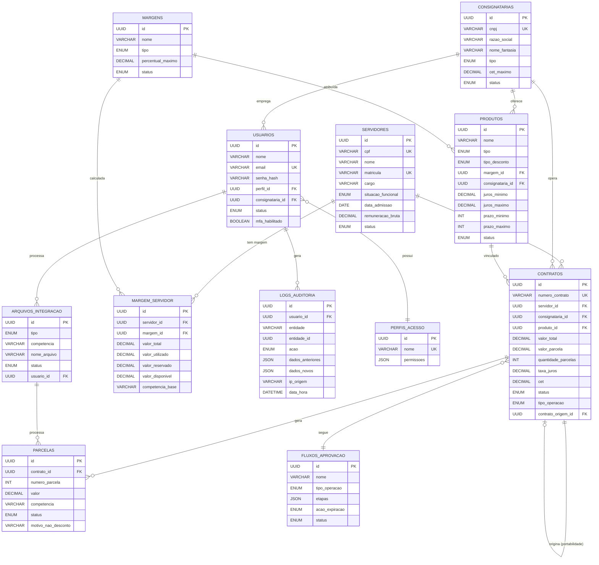

# Modelo Entidade-Relacionamento — Sistema de Consignação MACAEPREV

---

## Diagrama ER

---

## Cardinalidades Detalhadas

| Relacionamento | Cardinalidade | Descrição |
|----------------|--------------|-----------|
| Servidor → Contrato | 1:N | Um servidor pode ter vários contratos |
| Servidor → Margem_Servidor | 1:N | Um servidor tem uma margem por tipo de margem |
| Consignatária → Contrato | 1:N | Uma consignatária opera vários contratos |
| Consignatária → Produto | 1:N | Uma consignatária oferece vários produtos |
| Consignatária → Usuário | 1:N | Uma consignatária tem vários operadores |
| Margem → Produto | 1:N | Uma margem pode ter vários produtos atribuídos |
| Margem → Margem_Servidor | 1:N | Uma margem se aplica a vários servidores |
| Produto → Contrato | 1:N | Um produto pode estar em vários contratos |
| Contrato → Parcela | 1:N | Um contrato gera várias parcelas |
| Contrato → Contrato | 1:0..1 | Um contrato pode originar outro (portabilidade) |
| Fluxo → Contrato | 1:N | Um fluxo se aplica a vários contratos do mesmo tipo |
| Perfil → Usuário | 1:N | Um perfil é atribuído a vários usuários |
| Usuário → Log_Auditoria | 1:N | Um usuário gera vários logs |
| Usuário → Arquivo_Integração | 1:N | Um usuário processa vários arquivos |
| Arquivo_Integração → Parcela | 1:N | Um arquivo processa várias parcelas |

---

## Índices Recomendados

| Tabela | Índice | Tipo | Colunas |
|--------|--------|------|---------|
| servidores | idx_servidores_cpf | Unique | cpf |
| servidores | idx_servidores_matricula | Unique | matricula |
| contratos | idx_contratos_servidor | Index | servidor_id |
| contratos | idx_contratos_consignataria | Index | consignataria_id |
| contratos | idx_contratos_status | Index | status |
| parcelas | idx_parcelas_contrato | Index | contrato_id |
| parcelas | idx_parcelas_competencia | Index | competencia |
| parcelas | idx_parcelas_status | Index | status |
| logs_auditoria | idx_logs_data | Index | data_hora |
| logs_auditoria | idx_logs_usuario | Index | usuario_id |
| logs_auditoria | idx_logs_entidade | Index | entidade, entidade_id |
| margem_servidor | idx_margem_srv_unique | Unique | servidor_id, margem_id |
