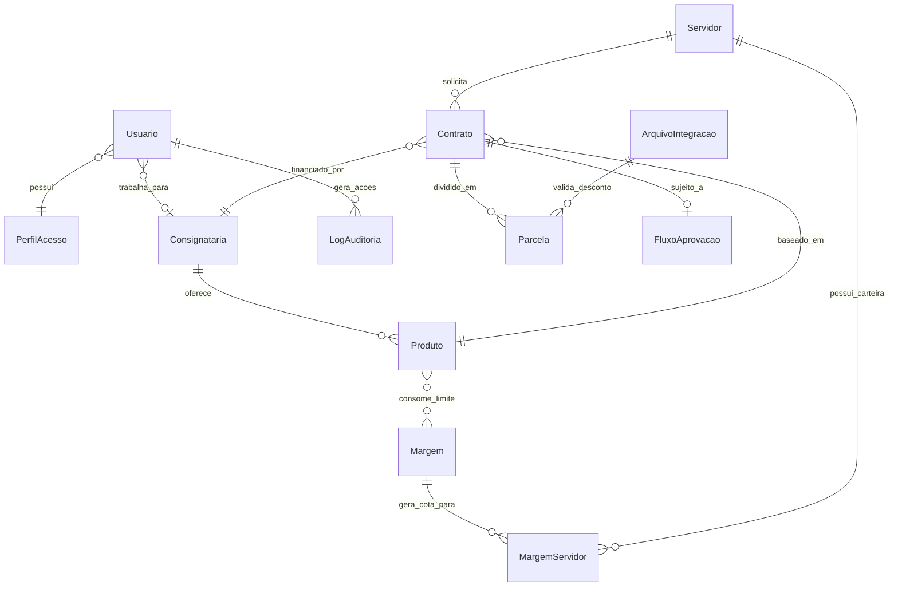

# Modelo Entidade-Relacionamento (ER)

**Data:** 12 de maio de 2026  
O diagrama a seguir representa a estrutura relacional macro do sistema MACAEPREV.

### Descrição da Cardinalidade

1. **Usuário / Consignatária:** Relacionamento (N:1). Um usuário de banco só pode pertencer a uma Consignatária, embora uma Consignatária possa ter múltiplos usuários (agentes). Usuários do MACAEPREV terão este campo como `NULL`.
2. **Servidor / Contrato:** Relacionamento (1:N). Um servidor pode ter múltiplos empréstimos ativos, desde que a soma das suas parcelas não ultrapasse o limite em `MargemServidor`.
3. **Contrato / Parcela:** Relacionamento (1:N). Um empréstimo consignado gera N parcelas baseadas no atributo `prazo_max_meses`.
4. **ArquivoIntegracao / Parcela:** Relacionamento (1:N). Um arquivo de retorno mensal vindo da Folha de Pagamento afeta diversas parcelas, validando se o status migra para `DESCONTADA`.

### Índices Estratégicos Configurados

- **CPF (`Servidor`)**: Índice único (`BTREE`) para busca rápida durante averbações.
- **CNPJ (`Consignataria`)**: Índice único.
- **Competência (`Parcela`)**: Indexação composta `(contrato_id, competencia)` para evitar lentidão no processamento dos retornos da folha.
