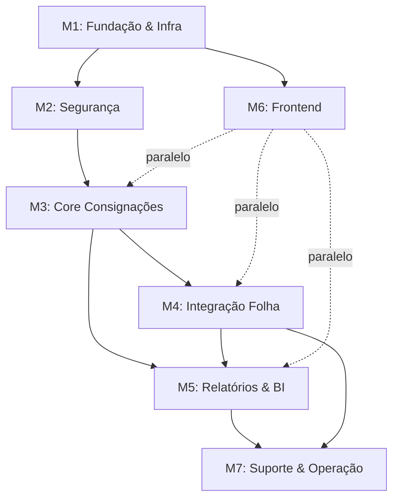

# Sistema de Consignação MACAEPREV — Plano de Projeto

## 1. Resumo do Contexto

O projeto trata da **prestação de serviços de controle operacional e gerencial das operações de consignação com desconto em folha de pagamento** para o Instituto de Previdência Social do Município de Macaé (MACAEPREV). Inclui cessão de uso de software web, suporte técnico, treinamento e migração de dados.

---

## 2. Resumo dos Requisitos (requisitos.md)

Os requisitos se dividem em **7 categorias principais**:

| # | Categoria | Requisitos |
|---|-----------|-----------|
| A | **Plataforma & Compatibilidade** | Web, Edge/Chrome/Firefox, independência de BD relacional (4.1.1, 4.1.12, 4.1.17.13) |
| B | **Gestão de Consignações** | Produtos (empréstimo, cartão, saúde, seguro), margens exclusivas/compartilhadas, CET, contratos, portabilidade, renegociação (4.1.3–4.1.8, 4.1.16.1) |
| C | **Integração com Folha** | Migração de dados, arquivos mensais, conciliação de parcelas, compatibilidade com folha MACAEPREV (4.1.2, 4.1.14–4.1.16) |
| D | **Auditoria & Segurança** | Logs de tela, auditoria completa, controle de acesso por perfil, LGPD, SSL, criptografia, assinatura digital (4.1.6, 4.1.9, 4.1.17.4, 4.1.17.10, 4.1.17.13) |
| E | **Relatórios & BI** | Exportação CSV, dashboards, gráficos, ranking de promotores, informações gerenciais por perfil (4.1.7.3, 4.1.11, 4.1.16.3) |
| F | **Configuração & Fluxos** | Fluxo de aprovação configurável, novas modalidades sob demanda, configuração de juros/prazos/cargos (4.1.4, 4.1.5, 4.1.16.2) |
| G | **Infraestrutura & Suporte** | Backup 14 dias, 99% uptime, banda 100Mbps, rede 3 camadas, suporte contínuo, práticas ágeis (4.1.17.2–4.1.17.13) |

---

## 3. Mapeamento Requisitos → POC (30 Questões)

Cada questão da POC referencia diretamente um requisito. Abaixo o mapeamento com a **estratégia de atendimento**:

### Grupo A — Plataforma & Compatibilidade

| POC | Req. | O que demonstrar |
|-----|------|-----------------|
| **1** | 4.1.1 | Sistema acessível via Edge, Chrome e Firefox — responsivo |
| **15** | 4.1.12 | Homologação nos 3 browsers com evidências (screenshots/vídeo) |
| **23** | 4.1.17.2 | Compatibilidade com infraestrutura de TI municipal |

### Grupo B — Gestão de Consignações

| POC | Req. | O que demonstrar |
|-----|------|-----------------|
| **3** | 4.1.3 | Tela de cadastro de produtos (empréstimo, cartão, saúde, seguro) + averbação por valor/percentual |
| **4** | 4.1.4 | Funcionalidade de inclusão de novas modalidades via admin |
| **5** | 4.1.5 | Config de margens (exclusiva/compartilhada), teto de juros, prazos, cargos elegíveis |
| **7** | 4.1.7 | Cálculo de margem com base na última folha + transações pós-corte |
| **8** | 4.1.7.1 | Registro de contratos + conciliação de parcelas descontadas |
| **9** | 4.1.7.2 | Fluxo de portabilidade e renegociação com garantia de margem |
| **11** | 4.1.8 | Validação de CET máximo ao incluir contrato |
| **20** | 4.1.16.1 | Módulo completo de portabilidade: saldo devedor → liquidação |

### Grupo C — Integração com Folha

| POC | Req. | O que demonstrar |
|-----|------|-----------------|
| **2** | 4.1.2 | Ferramenta de migração de base existente |
| **17** | 4.1.14 | Integração de arquivos compatível com folha MACAEPREV |
| **18** | 4.1.15 | Geração/carga mensal de arquivos + apontamento de divergências |
| **19** | 4.1.16 | Dados segmentados por Consignante/Consignatária |

### Grupo D — Auditoria & Segurança

| POC | Req. | O que demonstrar |
|-----|------|-----------------|
| **6** | 4.1.6 | Logs visíveis nas telas + auditoria detalhada |
| **12** | 4.1.9 | Registro de acessos + controle por perfil individual |
| **24** | 4.1.17.4 | Criptografia de dados sensíveis + controle de acesso |
| **28** | 4.1.17.10 | Conformidade LGPD (consentimento, anonimização, exclusão) |
| **29** | 4.1.17.13 | Infra completa: backup, SSL, assinatura digital, criptografia URL, BD agnóstico |

### Grupo E — Relatórios & BI

| POC | Req. | O que demonstrar |
|-----|------|-----------------|
| **10** | 4.1.7.3 | Dashboards: ranking promotores, volume por período, produtividade |
| **14** | 4.1.11 | Exportação CSV + relatórios/gráficos gerenciais |
| **16** | 4.1.13 | Histórico de consignações e dados de Consignatárias |
| **22** | 4.1.16.3 | Módulo BI: conciliação, motivos suspensão, filtros, gráficos |
| **30** | 4.2.1 | Relatório mensal de receita (repasse de taxas ao MACAEPREV) |

### Grupo F — Configuração & Fluxos

| POC | Req. | O que demonstrar |
|-----|------|-----------------|
| **21** | 4.1.16.2 | Fluxo de aprovação configurável (responsáveis, ordem, prazos) |

### Grupo G — Infraestrutura & Suporte

| POC | Req. | O que demonstrar |
|-----|------|-----------------|
| **13** | 4.1.10 | Manual online integrado ao sistema |
| **25** | 4.1.17.5 | Práticas ágeis (Scrum/Kanban), entrega contínua |
| **26** | 4.1.17.6 | SLA de suporte técnico + manutenção preventiva/corretiva |
| **27** | 4.1.17.8 | Suporte contínuo + manutenções preventivas |

---

## 4. Estrutura do Projeto — Milestones, Issues e Sub-issues

### Milestone 1 — Fundação & Infraestrutura
> **Objetivo**: Preparar toda a base técnica do projeto.
> **Duração estimada**: 4 semanas

#### Issue 1.1 — Definição de Arquitetura
- **Sub-issue 1.1.1** — Configurar projeto Node.js (API REST) + Next.js + TypeScript + CSS externo
- **Sub-issue 1.1.2** — Projetar arquitetura modular (monolito modular com separação API/Frontend)
- **Sub-issue 1.1.3** — Definir padrão de API REST com documentação OpenAPI/Swagger
- **Sub-issue 1.1.4** — Configurar infraestrutura AWS (EC2/ECS, RDS PostgreSQL, S3, CloudFront)
- **Dependência**: Nenhuma

#### Issue 1.2 — Infraestrutura Cloud/Hosting
- **Sub-issue 1.2.1** — Provisionar servidores (99% uptime, 100Mbps) → **POC 29**
- **Sub-issue 1.2.2** — Configurar backup diário com 14 dias de retenção → **POC 29**
- **Sub-issue 1.2.3** — Configurar rede 3 camadas de segurança → **POC 29**
- **Sub-issue 1.2.4** — Implementar SSL 128-bit + criptografia de URL → **POC 24, 29**
- **Dependência**: 1.1

#### Issue 1.3 — Banco de Dados PostgreSQL
- **Sub-issue 1.3.1** — Modelar entidades no PostgreSQL (Servidor, Consignatária, Contrato, Margem, Parcela, etc.)
- **Sub-issue 1.3.2** — Implementar ORM com Prisma/TypeORM para abstração de BD → **POC 29**
- **Sub-issue 1.3.3** — Criar migrations e seeds com dados simulados para POC
- **Sub-issue 1.3.4** — Configurar PostgreSQL no AWS RDS
- **Dependência**: 1.1

---

### Milestone 2 — Segurança & Autenticação
> **Objetivo**: Implementar toda a camada de segurança e conformidade.
> **Duração estimada**: 3 semanas

#### Issue 2.1 — Autenticação e Controle de Acesso
- **Sub-issue 2.1.1** — Sistema de login com MFA
- **Sub-issue 2.1.2** — Perfis de acesso granulares (admin, consignante, consignatária, servidor) → **POC 12**
- **Sub-issue 2.1.3** — Controle individual por funcionalidade → **POC 12**
- **Dependência**: 1.2, 1.3

#### Issue 2.2 — Auditoria & Logs
- **Sub-issue 2.2.1** — Sistema de log para todas as operações CRUD → **POC 6**
- **Sub-issue 2.2.2** — Exibição de últimos logs nas telas de cadastro → **POC 6**
- **Sub-issue 2.2.3** — Registro de acessos de usuários → **POC 12**
- **Sub-issue 2.2.4** — Assinatura digital de registros → **POC 29**
- **Dependência**: 2.1

#### Issue 2.3 — Conformidade LGPD
- **Sub-issue 2.3.1** — Consentimento e termos de uso → **POC 28**
- **Sub-issue 2.3.2** — Anonimização/pseudonimização de dados sensíveis → **POC 28**
- **Sub-issue 2.3.3** — Direito de exclusão/portabilidade de dados pessoais → **POC 28**
- **Dependência**: 2.1

---

### Milestone 3 — Core: Gestão de Consignações
> **Objetivo**: Implementar o motor central do sistema.
> **Duração estimada**: 6 semanas

#### Issue 3.1 — Cadastro de Produtos e Consignatárias
- **Sub-issue 3.1.1** — CRUD de tipos de produto (empréstimo, cartão, saúde, seguro, mensalidade) → **POC 3**
- **Sub-issue 3.1.2** — Averbação por valor nominal e percentual → **POC 3**
- **Sub-issue 3.1.3** — Inclusão dinâmica de novas modalidades → **POC 4**
- **Sub-issue 3.1.4** — Cadastro de Consignatárias com histórico → **POC 16**
- **Dependência**: 2.1

#### Issue 3.2 — Motor de Margem Consignável
- **Sub-issue 3.2.1** — Cálculo de margem com base na última folha → **POC 7**
- **Sub-issue 3.2.2** — Margens exclusivas e compartilhadas → **POC 5**
- **Sub-issue 3.2.3** — Configuração de teto de juros, prazos, cargos elegíveis → **POC 5**
- **Sub-issue 3.2.4** — Controle de transações pós-corte → **POC 7**
- **Sub-issue 3.2.5** — Validação de CET máximo → **POC 11**
- **Dependência**: 3.1

#### Issue 3.3 — Gestão de Contratos
- **Sub-issue 3.3.1** — Registro ágil de contratos com validação de margem → **POC 8**
- **Sub-issue 3.3.2** — Conciliação de parcelas descontadas → **POC 8**
- **Sub-issue 3.3.3** — Bloqueio para servidores sem margem → **POC 20**
- **Dependência**: 3.2

#### Issue 3.4 — Portabilidade & Renegociação
- **Sub-issue 3.4.1** — Solicitação de saldo devedor → **POC 9, 20**
- **Sub-issue 3.4.2** — Fluxo de liquidação de contrato existente → **POC 20**
- **Sub-issue 3.4.3** — Novo contrato liquidando anterior → **POC 20**
- **Sub-issue 3.4.4** — Garantia de margem durante o processo → **POC 9**
- **Dependência**: 3.3

#### Issue 3.5 — Fluxo de Aprovação
- **Sub-issue 3.5.1** — Engine de workflow configurável → **POC 21**
- **Sub-issue 3.5.2** — Definição de responsáveis e ordem de aprovação → **POC 21**
- **Sub-issue 3.5.3** — Prazo em dias para cada etapa → **POC 21**
- **Dependência**: 3.3

---

### Milestone 4 — Integração com Folha de Pagamento
> **Objetivo**: Garantir a comunicação bidirecional com o sistema de folha.
> **Duração estimada**: 4 semanas

#### Issue 4.1 — Migração de Dados
- **Sub-issue 4.1.1** — Parser de base legada → **POC 2**
- **Sub-issue 4.1.2** — Validação e limpeza de dados
- **Sub-issue 4.1.3** — Importação com log de divergências → **POC 2**
- **Dependência**: 1.3, 3.1

#### Issue 4.2 — Integração Mensal
- **Sub-issue 4.2.1** — Geração de arquivo de consignações para folha → **POC 18**
- **Sub-issue 4.2.2** — Carga de arquivo de retorno da folha → **POC 18**
- **Sub-issue 4.2.3** — Processamento de descontos e não-descontados → **POC 18**
- **Sub-issue 4.2.4** — Detecção de descontos não identificados → **POC 18**
- **Dependência**: 3.3

#### Issue 4.3 — Segmentação de Dados
- **Sub-issue 4.3.1** — Dados por Consignante (margem, descontos, baixas) → **POC 19**
- **Sub-issue 4.3.2** — Dados por Consignatária (pertinentes à instituição) → **POC 19**
- **Sub-issue 4.3.3** — Compatibilidade com formato da folha MACAEPREV → **POC 17**
- **Dependência**: 4.2

---

### Milestone 5 — Relatórios & Business Intelligence
> **Objetivo**: Módulos gerenciais e exportação de dados.
> **Duração estimada**: 3 semanas

#### Issue 5.1 — Dashboards Gerenciais
- **Sub-issue 5.1.1** — Ranking de promotores → **POC 10**
- **Sub-issue 5.1.2** — Volume de negócios por período → **POC 10**
- **Sub-issue 5.1.3** — Produtividade de correspondentes bancários → **POC 10**
- **Sub-issue 5.1.4** — Gráficos consolidados por perfil (Consignante/Consignatária/Servidor) → **POC 22**
- **Dependência**: 3.3, 4.2

#### Issue 5.2 — Relatórios & Exportação
- **Sub-issue 5.2.1** — Exportação CSV de qualquer consulta → **POC 14**
- **Sub-issue 5.2.2** — Relatórios com filtros avançados → **POC 22**
- **Sub-issue 5.2.3** — Conciliação com motivos de suspensão → **POC 22**
- **Sub-issue 5.2.4** — Relatório mensal de receita (repasse de taxas) → **POC 30**
- **Dependência**: 5.1

---

### Milestone 6 — Frontend & UX
> **Objetivo**: Interface web completa e homologada.
> **Duração estimada**: 4 semanas (paralelo aos milestones 3-5)

#### Issue 6.1 — Interface Web Responsiva
- **Sub-issue 6.1.1** — Design system e componentes base → **POC 1**
- **Sub-issue 6.1.2** — Telas de cadastro com logs inline → **POC 6**
- **Sub-issue 6.1.3** — Homologação Edge, Chrome, Firefox → **POC 1, 15**
- **Dependência**: 1.1

#### Issue 6.2 — Manual Online
- **Sub-issue 6.2.1** — Documentação integrada por módulo → **POC 13**
- **Sub-issue 6.2.2** — Help contextual nas telas
- **Dependência**: 6.1

---

### Milestone 7 — Suporte & Operação
> **Objetivo**: Preparar processos de suporte e manutenção.
> **Duração estimada**: 2 semanas

#### Issue 7.1 — Processos de Suporte
- **Sub-issue 7.1.1** — SLA de atendimento e manutenção preventiva → **POC 26, 27**
- **Sub-issue 7.1.2** — Canal de suporte técnico contínuo → **POC 27**
- **Dependência**: Todas as milestones anteriores

#### Issue 7.2 — Metodologia Ágil
- **Sub-issue 7.2.1** — Definir sprints e entregas contínuas → **POC 25**
- **Sub-issue 7.2.2** — Compatibilidade com padrões TI municipal → **POC 23**
- **Dependência**: Nenhuma (paralelo desde o início)

---

## 5. Diagrama de Dependências



---

## 6. Cobertura da POC

> [!IMPORTANT]
> Todas as 30 questões da POC estão mapeadas. Ao implementar as 7 milestones acima, **100% dos itens da POC serão cobertos**.

| POC | Issue | POC | Issue | POC | Issue |
|-----|-------|-----|-------|-----|-------|
| 1 | 6.1 | 11 | 3.2 | 21 | 3.5 |
| 2 | 4.1 | 12 | 2.1/2.2 | 22 | 5.1/5.2 |
| 3 | 3.1 | 13 | 6.2 | 23 | 7.2 |
| 4 | 3.1 | 14 | 5.2 | 24 | 1.2/2.1 |
| 5 | 3.2 | 15 | 6.1 | 25 | 7.2 |
| 6 | 2.2 | 16 | 3.1 | 26 | 7.1 |
| 7 | 3.2 | 17 | 4.3 | 27 | 7.1 |
| 8 | 3.3 | 18 | 4.2 | 28 | 2.3 |
| 9 | 3.4 | 19 | 4.3 | 29 | 1.2 |
| 10 | 5.1 | 20 | 3.4 | 30 | 5.2 |

---

## 7. Decisões Técnicas (Aprovadas)

| Item | Decisão |
|------|---------|
| **Backend** | Node.js — API REST |
| **Frontend** | React + TypeScript + Next.js |
| **Estilização** | CSS externo (folhas de estilo). **Proibido**: inline styles e styled-jsx |
| **Banco de Dados** | PostgreSQL |
| **Hospedagem** | AWS (Cloud) |
| **Formato Folha** | CSV (formato fixo, não alterável) |
| **Escopo POC** | Demonstração funcional completa com dados simulados |

---

## 8. Processo de Validação por Milestone

> [!IMPORTANT]
> Cada milestone só avança para a próxima após aprovação completa de todos os entregáveis abaixo.

Para **cada milestone concluída**, serão gerados **5 documentos obrigatórios**:

| # | Documento | Conteúdo |
|---|-----------|----------|
| 1 | **Documentação** | Descrição técnica do que foi implementado na milestone |
| 2 | **Teste** | Plano de testes, casos de teste executados e resultados |
| 3 | **Validação** | Checklist de requisitos/POC atendidos com status (✅/❌) |
| 4 | **Evidências** | Screenshots, vídeos, logs comprovando o funcionamento |
| 5 | **Entrega** | Resumo da entrega, versão, changelog e próximos passos |

### Fluxo de Aprovação por Milestone

```
Implementação → Testes → Documentação → Evidências → Validação → ✅ Aprovação → Próxima Milestone
```

### Questões da POC respondidas por Milestone

| Milestone | Questões POC Respondidas |
|-----------|-------------------------|
| M1 — Fundação & Infra | 1, 15, 23, 29 |
| M2 — Segurança | 6, 12, 24, 28 |
| M3 — Core Consignações | 3, 4, 5, 7, 8, 9, 11, 16, 20, 21 |
| M4 — Integração Folha | 2, 17, 18, 19 |
| M5 — Relatórios & BI | 10, 14, 22, 30 |
| M6 — Frontend & UX | 1, 13, 15 |
| M7 — Suporte & Operação | 25, 26, 27 |